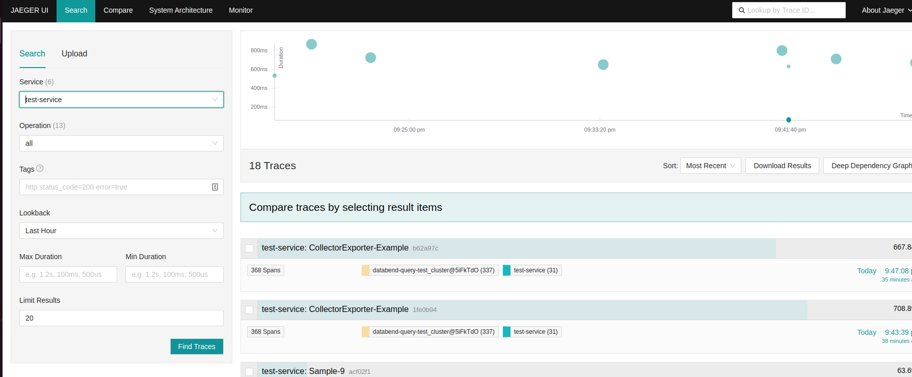
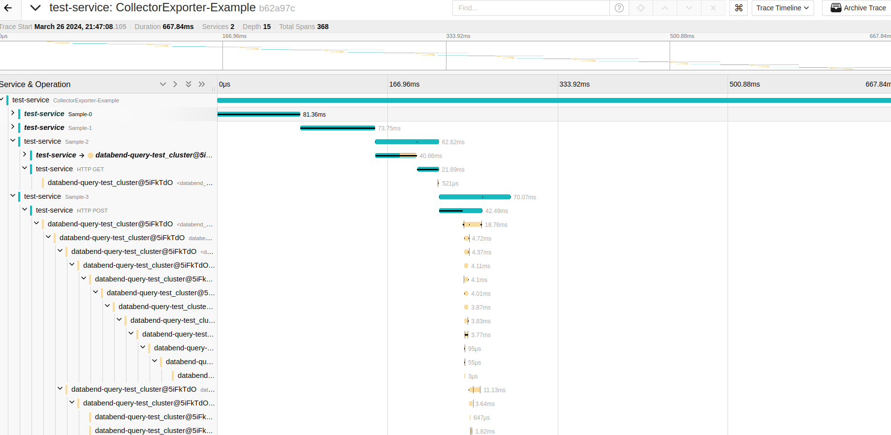
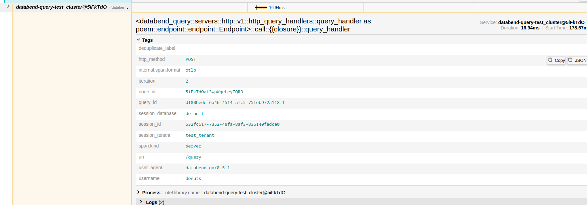

## Databend distributed tracing example

### How to set up demo environment

1. Install Docker and golang

2. Install Jaeger All In One
```bash
docker run --rm --name jaeger   -e COLLECTOR_ZIPKIN_HOST_PORT=:9411   -p 6831:6831/udp   -p 6832:6832/udp   -p 5778:5778   -p 16686:16686   -p 4317:4317   -p 4318:4318   -p 14250:14250   -p 14268:14268   -p 14269:14269   -p 9411:9411   jaegertracing/all-in-one:1.55
```

3. Setup databend config toml file with tracing enabled
```toml
[log.tracing]
on = true
capture_log_level = "TRACE"
otlp_endpoint = "http://0.0.0.0:4317"
```

4. Run golang example
```go
go run main.go
```

### How to view tracing data
visit `http://localhost:16686/` to view tracing data.
select test-service as the service target


### Expected result
totally 10 child span spawned from parent span, each span contains tracing information from existing databend cluster


in each child span, you expect to see attached baggage context
